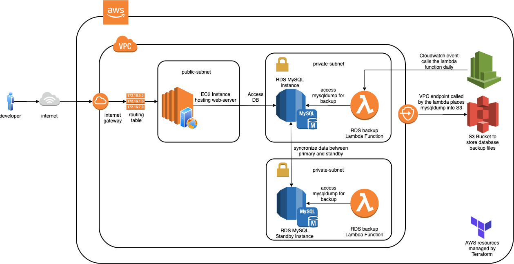

# RDSVC
## Relational Database Service Version Control
TODO: Add about details...

### Problem
According to the 2020 State of Database DevOps survey done by RedGate, when asked "which, if any of these practices are already in place for your application or database development?", only 56% of participants stated that they used version control for their database changes. However, having version control will provide:
1. Developers ability to rollback or retrieve previous versions of the database
2. Visibility into the development pipeline
3. Ease of collaboration as multiple developers edit the database

### Solution
Relational Database Service Version Control aims to address these through the following architecture:

### Installation
TODO: Add installation details
